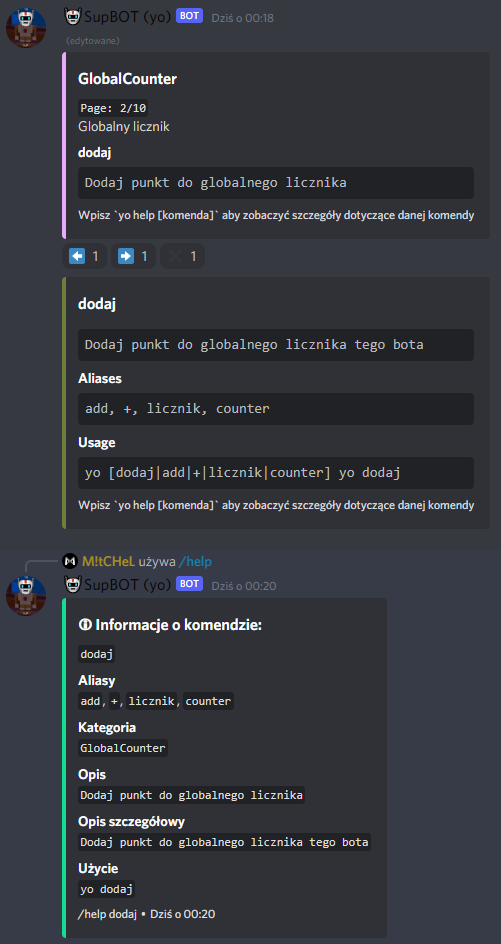
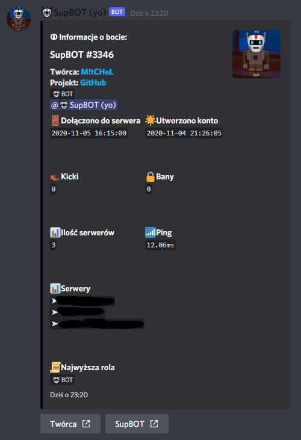
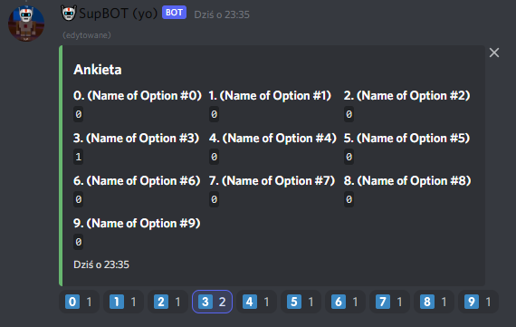
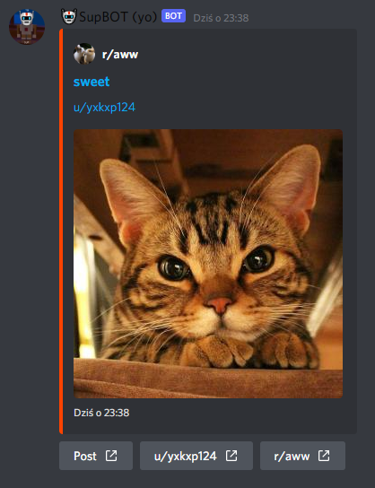
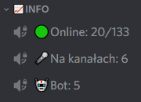

# Discord SupBOT


**SupBOT** is a multi purpose discord bot written in python.  

Bot supports both normal commands with **prefix** and new discord **slash** commands. 

Bot is written in **english**, but all messages are in **polish**. Bot was created with specific discord servers in mind, but **feel free to modify it and use it on your discord servers**.

# Features
## **Text**
**Admin**
* Bot administrators can send messages on any text channel visible to bot and direct message to any user visible to bot, as Bot

* Bot can send it's debug log as direct messages to bot administrators

**CustomHelp**
* Bot can show custom help information regarding any **prefix** command using [discord-pretty-help](https://github.com/stroupbslayen/discord-pretty-help)

* Bot can show custom help information regarding any **slash** command



**GlobalCounter**
* Users can add number to global counter every time they type a command

**Info**
* Bot can show info about any user and server visible to bot  

* Bot can show info about user that joined server on system channel

* Bot can show info about itself



**Poll**
* Bot can create polls with up to 10 options



**Reddit**
* Bot can send random images from any subreddit using [Async PRAW](https://github.com/praw-dev/asyncpraw)



**Other**
* Bot can show Poland's current lightning map from [blitzortung.org](https://www.blitzortung.org)

* Bot can pick an impostor on your voice channel

## **Voice**
**Soundboard**
* You can create your own soundboard and play specific sounds on voice channels

**TTS**
* Bot can say whatever you want on voice channels using [gTTS](https://github.com/pndurette/gTTS)

**VCDoorman**
* Bot can welcome user when someone joins voice channel and say goodbye when someone leaves

**VCHandler**
* Bot can join and leave your voice channel

* Bot detects what you want to play (YouTube/Soundboard/Text-To-Speech)

* Bot can stop playing current sound whenever you want

**VCVoteKick**
* You can vote to disconnect any user from your voice channel

**YouTube**
* Bot can play sounds from youtube videos using [youtube_dl](https://github.com/ytdl-org/youtube-dl)

## **Other**
**AI**
* Bot can change visibility for specific channels or categories if specific user is online

* This module was created for specific server, but feel free to modify it to suit your needs

**InfoChannelsUpdater**
* Bot can edit channels to display info about current state of discord server



**RoleAssigner**
* Bot can assign specific roles for user, when user joins specific server

**Debug**
* Bot can output debug messages to both log file and console

* You can disable debug for specific modules

# Hosting own instance

## Device
* Bot runs well on Raspberry Pi Zero W (YouTube may require faster hardware)
* Bot requires internet connection
* Bot was tested on **Linux**, but should work fine on **Windows**

## Installation
* Install **python** (Created on 3.9.5)

* Create python **virtual environment**
```shell
python -m venv env
```

* Use virtual environment
```python
source env/bin/activate
```

* Install required python packages
```shell
pip install -r requirements.txt
```

* Install **FFmpeg** and **Opus** binaries - required to voice support:
```shell
sudo apt install ffmpeg libopus0
```

* Create `.env` file:
```python
# .env
#discord
DISCORD_TOKEN=[YOUR_DISCORD_TOKEN]

#reddit
PRAW_CLIENT_ID=[YOUR_PRAW_CLIENT_ID]
PRAW_CLIENT_SECRET=[YOUR_PRAW_CLIENT_SECRET]
PRAW_USER_AGENT=[YOUR_PRAW_USER_AGENT]
```

* Tweak settings in `settings.json` file

* Run Bot (arguments show debug in both log file and console):
```shell
python -u main.py 2>&1 | tee -a output.log
```

## Other
* Bot should work fine using this permissions integer: **`2470051025`**

<hr>

## Credits
Code layout inspired by [Grzesiek11's](https://github.com/jedenastka) - [El Discord Bot](https://github.com/jedenastka/el-bot)  
Slash commands created using [discord-py-slash-command package](https://github.com/discord-py-interactions/discord-py-interactions)

## Licensing
[GNU GPL v3](LICENSE)